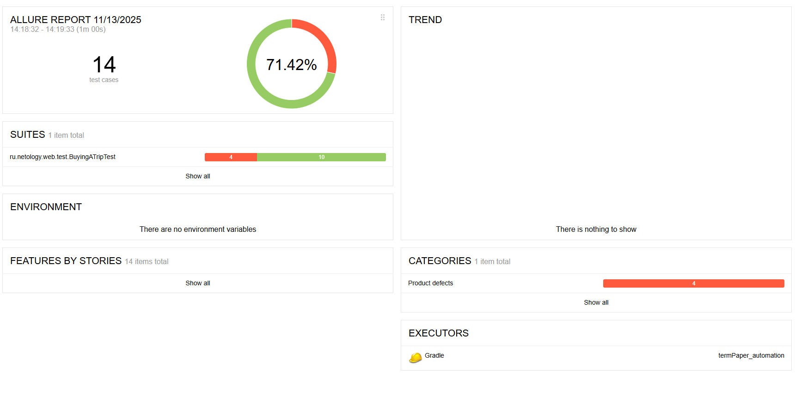

# Tour Purchase Test Automation

Проект по автоматизации тестирования веб-сервиса покупки тура.

---

## 🎯 О проекте

В рамках проекта автоматизировано тестирование веб-приложения, позволяющего приобрести тур:

- оплата по дебетовой карте  
- оформление покупки в кредит  

Приложение взаимодействует с банковскими сервисами и сохраняет статус операций в базе данных.

---

## 📌 Что было сделано

- анализ функциональности приложения  
- подготовка плана автоматизации  
- тестирование пользовательских сценариев  
- реализация UI-автотестов  
- проверка данных в базе  
- оформление тестовой документации и отчетов  

---

## 🛠 Стек

- Java  
- Gradle  
- JUnit 5  
- Selenide  
- Allure  
- Docker  
- MySQL / PostgreSQL  

---

## 🧪 Область тестирования

Тестировался сервис покупки тура:

- форма оплаты по карте  
- форма покупки в кредит  
- валидация полей  
- позитивные и негативные сценарии  
- сохранение статусов операций в базе данных  

---

## 🐞 Работа с дефектами

В процессе тестирования:

- выявлялись дефекты в логике приложения  
- проверялась корректность обработки пользовательских данных  
- анализировались ошибки взаимодействия с базой данных  
- оформлялись баг-репорты и проводился анализ причин ошибок

Найденные дефекты оформлены в Issues репозитория.
  
---

## 📂 Документация проекта

- 📄 [План автоматизации](./Plan.md)  
- 📄 [Отчёт по тестированию](./Report.md)  
- 📄 [Итоги проекта](./Summary.md)  

---

## ▶️ Запуск проекта

### 1. Подготовка окружения

Установить:

- Java 11+  
- Docker  
- Google Chrome  

### 2. Клонировать репозиторий

```bash
git clone https://github.com/stasya-03/tour-purchase-test-automation.git
cd tour-purchase-test-automation
```

### 3. Запуск тестового окружения

```bash
docker-compose up
```
После запуска приложение будет доступно по адресу: http://localhost:8080

### 4. Запуск автотестов

```bash
./gradlew clean test
```

### 5. Просмотр отчета Allure

```bash
./gradlew allureReport
./gradlew allureServe
```
---

## 📸 Отчет Allure

Пример отчета после выполнения автотестов:

<p align="center">
  
</p>

---

