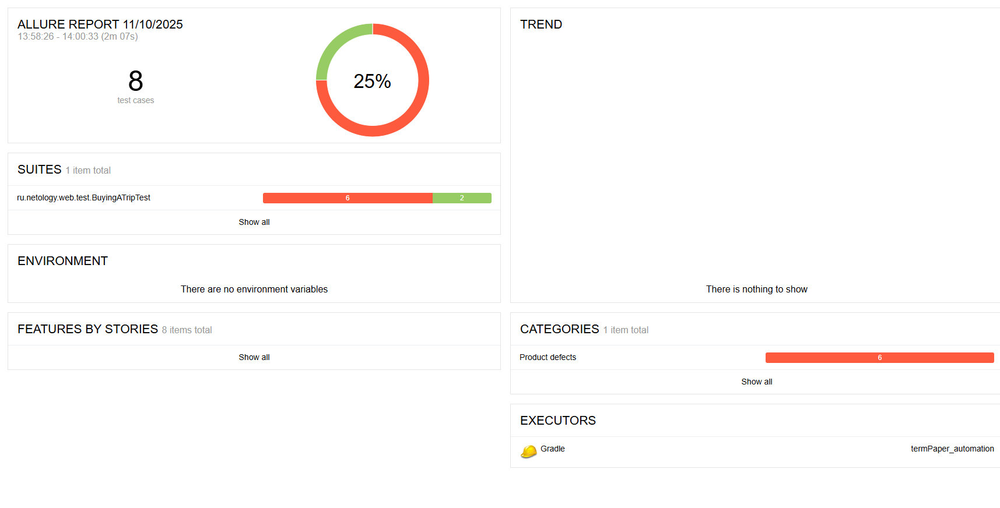
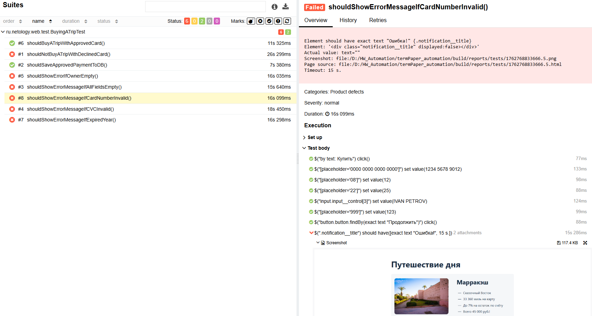

Были проведены автоматизированные тесты формы покупки тура с оплатой картой.
Проверялись сценарии с валидными и невалидными данными, а также поведение системы при отказе банка.

## Количество тест-кейсов
Всего тест-кейсов: 2  
Успешно пройдено: 1  
Провалено: 1

## Процент успешных и неуспешных тестов
Успешные: 50%  
Неуспешные: 50%

## Общие рекомендации
- Проверить корректность отображения сообщений об ошибках
- Убедиться, что тестовые данные и база данных синхронизированы

## Отчет Allure

